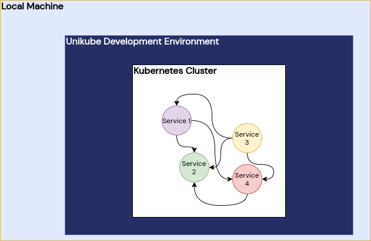
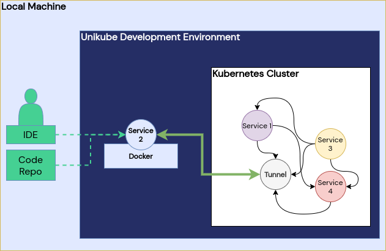

=======================
Developing with Unikube
=======================
Unikube does not simply give you the possibility to setup and run a local Kubernetes cluster. It aims to be an
application development system. Unikube developers are able to write code directly within a Kubernetes environment
without the need to take care of any Kubernetes aspects.

This chapter describes how you can prepare an application development setup to leverage the full convenience of the
Unikube CLI.

Get an Interactive Shell
========================
For a range of different tasks you may have to run application specific commands in your service, for instance create a
*superuser*. In order to easily get an interactive shell in an app container run
(see :ref:`unikube app shell<reference/app:shell>`):

.. code-block:: shell

   unikube app shell

You will be promted with all awailable apps in your current project context. Select the one you want and go ahead with
your command line superpower.

Switch Operation
================
The command (see :ref:`unikube app switch<reference/app:switch>`):

.. code-block:: shell

   unikube app switch

is the central entry point for local Kubernetes-based development. The idea is to literally *switch* a locally running
container with an instance running in a (Unikube provided) Kubernetes cluster. All network traffic from and to the
cluster instance is then tunneled to the local application. That enables developers to make changes to the source code,
files, environment variables (and other settings) and let them run in the context of all the other attached services.

   After running :code:`unikube deck install` (see :ref:`unikube deck install<reference/deck:install>`) a Kubernetes
   cluster is running all services.

   The command :ref:`unikube app switch<reference/app:switch>` (see :ref:`unikube app switch<reference/app:switch>`)
   starts a local container and tunnels all traffic to the target within the cluster.

You may run the :code:`unikube app switch` command with a long parameter list, or execute the command from a
location containing a `Unikubefile`_.

Before the actual ``switch operation`` is started, the Unikube CLI builds the container image according to the
specification in the `Unikubefile`_. Be sure your image can actually build with these parameters. The next step is
to start the container from your ``Dockerfile`` and mount the source code as volume in the container to always work
with the latest code. If you have overwritten environment variables they will be set in the container as well.
Before you can see the traffic hitting your local container you will be prompted for your root password. The Unikube CLI
has to perform DNS modifications on your host system in order to be able to reach services within the cluster.

If everything went fine to this point and your application server *supports code hot-reloading* you can see changes
in your current working tree immediately reflected in the cluster. You can still enter this container on an interactive
shell with the ``unikube app shell`` (see :ref:`unikube app shell<reference/app:shell>`) command.

This feature is realized with `Telepresence 2 <https://www.telepresence.io/>`__.

Unikubefile
===========

The *Unikubefile* is a file with *yaml* notation, that should contain all necessary information for Unikube about
the service. It specifies specify a Docker build, volumes, environment, commands and context. The file must be named
*unikube.yaml* for the command :code:`unikube app switch` (see :ref:`unikube app switch<reference/app:switch>`)
to be automatically used.

The `unikube.yaml` schema look like this:

.. code-block:: yaml

    # unikube switch configuration file
    version: 1.0

    apps:
      <app>: # title of this app
        context: # context information for the CLI
          organization: <Organization ID>
          project: <Project ID>
          deck: <Deck ID>
        build:
          context: <Path to Docker build root>
          dockerfile: <Path to Dockerfile>
          target: <Dockerfile build target>
        deployment: <Name of the Deployment in the cluster>
        command: <Starting command> # overwrite the run command of the services during development
        volumes:
          - <Path to the volume mounts> # overwrite the container's source directory with your working tree
        env:
          - <Environment variable>:<Value> # overwrite environment variables from the deployment, see: unikube app env

Most of the keys in the Unikubefile are optional. Here is a description what those keys control:

**context**: The sub-keys of the first level *context* item are used control the
:ref:`CLI's context<reference/overview:Context management>`.
For your convenience you can set the organisation, the project and the deck this service belongs to. You don't have to
specify this during the `switch operation`_ anymore.

**build**: This section belongs to the Docker ``build`` process just before the `switch operation`_. Please refer to the
Docker documentation for more details.

**deployment**: This is the target Kubernetes deployment for the `switch operation`_. This must exactly match the
name of the deployment running in the cluster.

**command**: If you container does not specify a run command or you want to overwrite it, that's the place for it. Write
it as a single string.

**volumes**: Specify volume mounts for the development container, for instance your current working tree.

**env**: Overwrite existing environment variables (such as debug flags) or add new environment variables. Please request
these new environment variables at your Kubernetes manifest author if you need them in production as well.

The source repository of the project should include a valid Dockerfile and a Unikubefile to run this operation as smooth
as possible.
