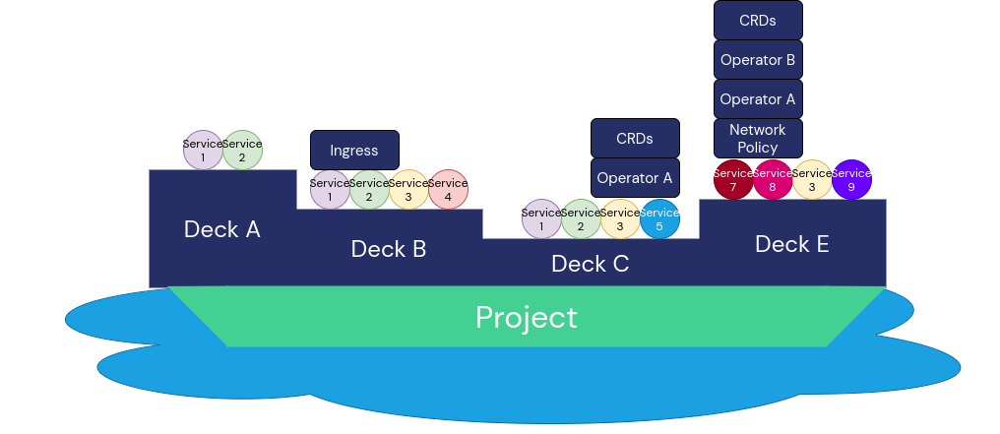
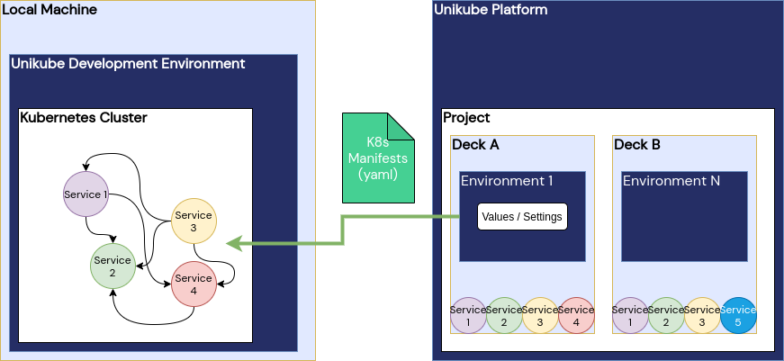

======================================
Provision of a Development Environment
======================================
The Unikube CLI provides a convenient procedure to set up a Kubernetes-based development environment
(see :ref:`unikube project up<reference/project:up>`). This K8s cluster can be initially started, stopped, resumed and
delete with the CLI. The infrastructure is encapsulated in the concept of a ``project``. The Unikube CLI currently
allows you to have at most one project cluster running at a time. If you need to work on another project, you have to
stop the project you may worked on before.

The project cluster can be created using different Kubernetes-providers. Currently, `k3d <https://k3d.io>`__ is the
default cluster provider as it allows you to have multiple disjunct clusters side-by-side on one local machine. Anyway,
there will be other Kubernetes-providers like ``microk8s``, ``minikube`` or ``dedicated remote K8s clusters`` in the
future. The Unikube CLI will, however, abstract those details and provide you a uniform interface.

What is a Deck?
===============
*Deck* is a new concept coming with Unikube. A simple attempt to explain it would be:

    "A deck is the smallest installable unit in Unikube"

To stay with the nautical metaphors around Kubernetes: You may work on a large ship and that very ship is divided into
multiple decks. You can work one day on deck A - and on deck B the other day. However, since both decks are on the same
ship they share a common ground.
The Unikube team decided to call installable units a deck, because even the smallest ships has at least one deck.
Decks on a ship usually serve different purposes or offer certain capabilities and so are decks in Unikube.

   I asked my daughter to draw a ship with multiple decks and different Kubernetes-resources on them. That's what she
   did. I hope that helps to get the metaphor across.

Decks do share common components which might end up as a production platform playing together. However, since
it is not always feasible to run the entire production infrastructure on you Pentium i3 notebook, decks form
a certain excerpt for you to work on. Just enough to get your work done in the required context. If you need another
deck, ask your operators to create it upon your requirements or go on and define it yourself.

Deck Installation
=================
Installing a deck is quite simple. You run (see :ref:`unikube deck install<reference/deck:install>`):

.. code-block:: shell

   unikube deck install

Select a deck (or pass it as an argument) and the Unikube CLI prepares everything for you. Just wait until you cluster
is ready.

   After running :code:`unikube deck install` the Unikube platform prepares the workload manifests and everything and
   sends it to the CLI to apply it in the development cluster

Depending on the ``Environment`` settings on the Unikube platform, a deck is installed to a dedicated K8s namespace.
If it's required you can still access this cluster using ``kubectl`` and manage things yourself. However, the Unikube
team is working hard to make this a obsolete option.

Deck Uninstallation
===================
You can uninstall a deck as well. The command :code:`unikube deck uninstall`
(see :ref:`unikube deck uninstall<reference/deck:uninstall>`) allows you to select the superfluous deck and removes
it from your cluster.

Delete a Project
================
Once your project is completed and there is no task for you left (more or less a theoretical construct), or
you want to free some resources on your Pentium i3-notebook, you can run :code:`unikube project delete`
(see :ref:`unikube project delete<reference/project:delete>`).

**Beware:** Deleting a project removes the entire Kubernetes cluster and doesn't leave anything behind. This is
terminal.
